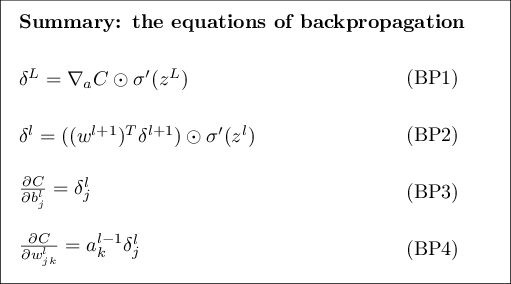

# Notes for Neural Networks and Deep Learning

## [Using neural nets to recognize handwritten digits](http://neuralnetworksanddeeplearning.com/chap1.html)

## [How the backpropagation algorithm works](http://neuralnetworksanddeeplearning.com/chap2.html)

### [Warm up: a fast matrix-based approach to computing the output from a neural network](http://neuralnetworksanddeeplearning.com/chap2.html#warm_up_a_fast_matrix-based_approach_to_computing_the_output _from_a_neural_network)

### [The two assumptions we need about the cost function](http://neuralnetworksanddeeplearning.com/chap2.html#the_two_assumptions_we_need_about_the_cost_function)

### [The Hadamard product](http://neuralnetworksanddeeplearning.com/chap2.html#the_hadamard_product_$s_\odot_t$)
$$s \odot t$$:
  * the *elementwise* product of two vectors $$ s $$ and $$ t $$
  * called *Hadamard product* or *Schur product*

### [The four fundamental equations behind backpropagation](http://neuralnetworksanddeeplearning.com/chap2.html#the_four_fundamental_equations_behind_backpropagation)

* measure of error
  * $$
      \delta^l_j =
      \frac{\partial C}{\partial z^l_j}
    $$ - here delta is the "inexact derivative" or incremental amount changed in 
    hidden neuron $$ j $$ at layer $$ l $$, and it's set to be the partial 
    derivative of the Cost function w.r.t the logistic logit at that neuron.

#### BP1 - error in the output layer $$ \delta^L $$

* **BP1**: $$
  \begin{eqnarray} 
    \delta^L_j = \frac{\partial C}{\partial a^L_j} \sigma'(z^L_j).
  \tag{BP1}\end{eqnarray}
  $$
  * $$ \partial C / \partial a^L_j $$
    * how fast cost is changing as a function of $$ j^{\text(th)} $$ output activation
    * if cost *C* doesn't depend on neuron *j*, then $$ \delta^L_j $$ will be small
    * if using quadratic / squared error, 
      $$
      C = \frac{1}{2} \sum_j
      (y_j-a^L_j)^2
      $$, and so
      $$
      \partial C / \partial a^L_j = (a_j^L-y_j)
      $$ (notice the reversal of terms since the derivative of the inner term is -1)
  * $$ \sigma'(z^L_j) $$
    * how fast the activation function $$ \sigma $$ is changing at $$ z^L_j $$
  * $$ z^L_j $$ is computed during forward pass
  * it is a componentwise expression for $$ \delta^L $$
* **BP1a**: $$
  \begin{eqnarray} 
    \delta^L = \nabla_a C \odot \sigma'(z^L).
  \tag{BP1a}\end{eqnarray}
  * $$ \nabla_a C $$
    * a vector whose components are the partial derivatives
      $$ \partial C / \partial a^L_j $$
    * expresses the rate of change of *C* w.r.t. output activations
  * equivalent to *BP1*
  * with quadratic cost / squared error we have $$ \nabla_a C = (a^L-y) $$
    * so then BP1 becomes $$
      \begin{eqnarray} 
        \delta^L = (a^L-y) \odot \sigma'(z^L).
      \tag{30}\end{eqnarray}
      $$

#### BP2 - An equation for the error $$ \delta^l $$ in terms of next layer

* **BP2**: $$
    \delta^l 
    = (
      ( w^{l+1} )^T \delta^{ l+1 } 
    ) \odot \sigma'(z^l)
  $$
  * $$ (w^{l+1})^T $$: the transpose of the weight matrix $$ w^{l+1} $$ for
    the next layer
  * if we know the error $$ \delta^{l+1} $$ of the next layer, then when 
    we multiply the transpose weight matrix $$ (w^{l+1})^T $$ by it,
    we are moving the error backward through the network, giving 
    the error at layer *l*.
  * By taking Hadamard product $$ \odot \sigma'(z^l) $$, we move
    error through the activation function in layer *l*, giving us error
    $$ \delta^l $$ in the weighted input to layer *l*
  * combining **BP2** and **BP1** we can use **BP1** to compute $$ \delta^L $$
    then apply **BP2** to compute $$ \delta^{L-1} $$, then **BP2** again to 
    compute $$ \delta^{L-2} $$ and so on through network

#### BP3 - rate of change of cost w.r.t. any bias in network

* **BP3**: $$
  \frac{ \partial C }{ \partial b^l_j } =
    \delta^l_j.
  $$
  * error $$ \delta^l_j $$ is equal to rate of change $$ 
    \frac{ \partial C }{ \partial b^l_j } $$.
* **BP3-vec**: $$
  \frac{ \partial C }{ \partial b } = \delta
  $$, where *b* is evaluated at same neuron as $$ \delta $$.

#### BP4 - change of cost w.r.t. any weight in network:

* **BP4**: $$
  \frac{ \partial C }
  { \partial w^l_{jk} } 
  = a^{ l-1 }_k \delta^l_j
  $$
  * how to compute partial derivatives of cost w.r.t. weight using
    $$ \delta^l $$ and $$ a^{l-1} $$, which are already known
* **BP4-vec**: $$
  \frac{ \partial C }
  { \partial w } 
  = a_{ \rm in } \delta_{ \rm out }
  $$
  * $$ a_{ \rm in } $$ is the activation into the weight *w*
  * $$ \delta_{ \rm out } $$ is the error of neuron output w.r.t. the weight
  * the product of these is the partial deriv of Cost w.r.t. the weight
    * the partial deriv of Cost w.r.t. the weight is called "the gradient term"
    * when $$ a_{ \rm in } $$ is near zero, weight *learns slowly*
  * "the output neuron is *saturated*" when output neuron is low activation 
    ($$ \approx 0 $$) or high activation ($$ \approx 1 $$)
    * then learning happens slowly or has "stopped" learning

#### Summary

### [Proof of the four fundamental equations (optional)](http://neuralnetworksanddeeplearning.com/chap2.html#proof_of_the_four_fundamental_equations_(optional))

### [The backpropagation algorithm](http://neuralnetworksanddeeplearning.com/chap2.html#the_backpropagation_algorithm)

### [The code for backpropagation](http://neuralnetworksanddeeplearning.com/chap2.html#the_code_for_backpropagation)

### [In what sense is backpropagation a fast algorithm?](http://neuralnetworksanddeeplearning.com/chap2.html#in_what_sense_is_backpropagation_a_fast_algorithm)

### [Backpropagation: the big picture](http://neuralnetworksanddeeplearning.com/chap2.html#backpropagation_the_big_picture)

## [Improving the way neural networks learn](http://neuralnetworksanddeeplearning.com/chap3.html)

## [A visual proof that neural nets can compute any function](http://neuralnetworksanddeeplearning.com/chap4.html)

## [Why are deep neural networks hard to train?](http://neuralnetworksanddeeplearning.com/chap5.html)

## [Deep learning](http://neuralnetworksanddeeplearning.com/chap6.html)

