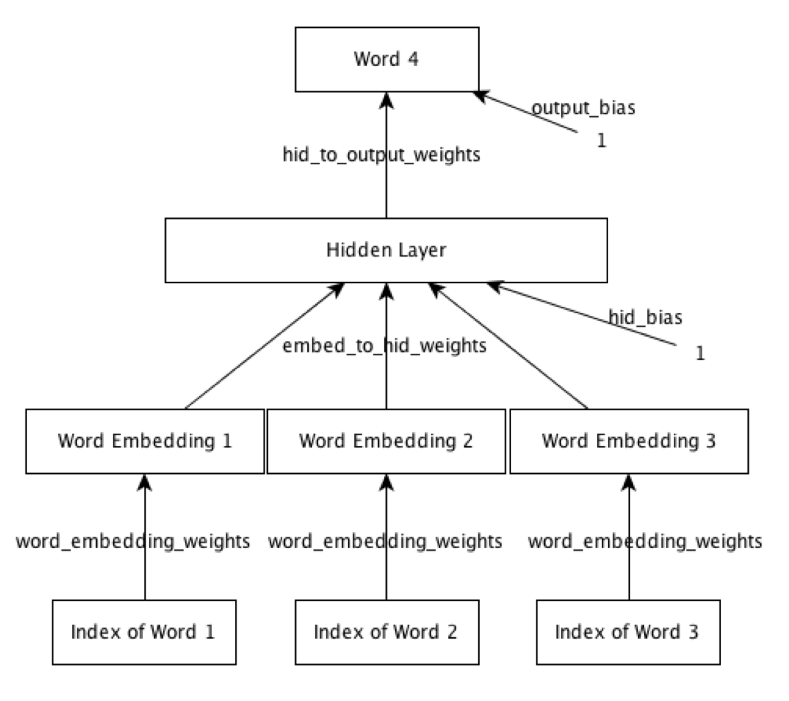

# Assignment 2 - Learning word representations.

## Overview
* general process is to feed each mini batch through forward propagation, 
  then use backpropagation to update weights at each layer, updating the weights
  each time.
* the cross-entropy error should decrease as time goes on. at beginning of assignment
  it remains constant because the optimization is left out.
* network topology: 
  


## Todos
- [in progress] explain code
- [ ] review backpropagation algorithm
- [ ] implement `fprop.m` 
- [ ] implement `train.m`
- [ ] experiment, summarize results here
- [ ] take assignment 2 quiz


## File Notes

### `train.m`

#### For each epoch and each mini-batch

##### Setup `input_batch`, `target_batch`
```octave
input_batch = train_input(:, :, m);
target_batch = train_target(:, :, m);
```
* `train_input` contains stack of training cases of (`words`, `cases_in_batch`)
  * `m` is the mini-batch number we're focusing on
* `input_batch` contains (`words`, `cases_in_batch`) for the selected mini-batch 
* `target_batch` also contains (`words`, `cases_in_batch`), except it's the target output
  for the input batch, so it's if there are `D` elements in `cases_in_batch`, it's of dimension
  `1xD`.
* `words` here refers to the index of the word in the vocabulary

##### Call forward network propagation
```octave
% FORWARD PROPAGATE.
% Compute the state of each layer in the network given the input batch
% and all weights and biases
[embedding_layer_state, hidden_layer_state, output_layer_state] = ...
  fprop(input_batch, ...
        word_embedding_weights, embed_to_hid_weights, ...
        hid_to_output_weights, hid_bias, output_bias);
```
* `fprop.m` is called, which takes as parameters:
  * `input_batch` described above; 3 rows for each word in training; columns are batch cases
  * `word_embedding_weights`, a vector updated after each run through net
    * initialized to `init_wt * randn(vocab_size, numhid1);`
    * [`randn(vocab_size, numhid1)`](https://www.gnu.org/software/octave/doc/interpreter/Special-Utility-Matrices.html#XREFrandn):
      "Return a matrix with normally distributed random elements having zero mean and variance one. 
      The arguments are handled the same as the arguments for `rand`."
    * returns a matrix of random values from (-1, 1) scaled to `init_wt`, which is `0.01` by default; 
      that way the standard deviation is 1%.
    * `numhid1 = 50;  % Dimensionality of embedding space; default = 50.`
    * each of the 50 embedded layer units store one weight for each word in the vocab
    * `init_wt` is a scalar and `randn` is a matrix that is (`vocab_size`, `50`).
    * `word_embedding_weights` is a matrix where rows correspond to a single word in the vocab 
      and columns are the weights for that word for each of the 50 embedding layer units.
      They are initialized to random values in a normal distribution with standard deviation of
      +/- 0.01 of 0.
  * `embed_to_hid_weights` is initialized `init_wt * randn(numwords * numhid1, numhid2);`
    * one row for each weight stored in `word_embedding_weights`
      * *Q: this surprises me a little bit. does this imply that we have skip layer connections?*
      * *Q: why isn't it one output weight for each neuron in the embedding layer?*
    * one column for each unit in the hidden layer; by default there are 200 columns
    * weights are initialized to random values +/- 0.01 of 0 like `word_embedding_weights`
  * `hid_bias` is initialized to `zeros(numhid2, 1);`
    * it's a vector storing a bias for each of the 200 hidden units, by default 0
  * `output_bias` is initialized to `zeros(vocab_size, 1);`
    * it's a vector storing a bias for each of the words in the vocab, by default 0
* `fprop` returns values `embedding_layer_state`, `hidden_layer_state`, `output_layer_state`
  * `embedding_layer_state`: "State of units in the embedding layer as a matrix of
    size `numhid1*numwords X batchsize`"
    * *Q: rows are the weights for each word in the embedding layer?*
      * or is it one row for each output of the embedding layer, and there are 
        `50xnumhid1` units? Maybe I don't understand something about how embedding is 
        supposed to work
    * columns are the values after each training case in mini-batch
  * `hidden_layer_state`: "State of units in the hidden layer as a matrix of size
    `numhid2 X batchsize`"
    * *Q: one row for each hidden layer unit output?*
    * one column for each training case in the mini-batch
  * `output_layer_state`: "State of units in the output layer as a matrix of size
     `vocab_size X batchsize`"
     * one row for each word
     * one column for each training case in mini-batch
  

## Progress Notes

### 2017-04-23
* add notes for *Call forward network propagation* 


### 2017-04-22
* configured 2nd computer for octave/matlab textmate syntax highlighting
* read through source code and began notes on `train.m`


### 2017-04-21 
* configured pycharm for using the octave/matlab textmate syntax highlighting bundle
  * considered [this plugin from 2013](https://github.com/tomconder/octaveplugin/issues/1) but decided against it
  * [pycharm instructions](https://confluence.jetbrains.com/display/PYH/TextMate+Bundles+in+PyCharm)
  * [matlab.tmbundle](https://github.com/textmate/matlab.tmbundle)
* added `./assignment_2_instructions.pdf`
* added commit template


## Instructions

In this assignment, you will design a neural net language model that will
learn to predict the next word, given previous three words.

The data set consists of 4-grams (A 4-gram is a sequence of 4 adjacent words
in a sentence). These 4-grams were extracted from a large collection of text.
The 4-grams are chosen so that all the words involved come
from a small vocabulary of 250 words. Note that for the purposes of this
assignment special characters such as commas, full-stops, parentheses etc
are also considered words. The training set consists of 372,550 4-grams. The
validation and test sets have 46,568 4-grams each.

### GETTING STARTED
Look at the file raw_sentences.txt. It contains the raw sentences from which
these 4-grams were extracted. Take a look at the kind of sentences we are
dealing with here. They are fairly simple ones.

To load the data set, go to an octave terminal and cd to the directory where the
downloaded data is located. Type

`> load data.mat`

This will load a struct called 'data' with 4 fields in it.
You can see them by typing

`> fieldnames(data)`

'data.vocab' contains the vocabulary of 250 words. Training, validation and
test sets are in 'data.trainData', 'data.validData' and 'data.testData'  respectively.
To see the list of words in the vocabulary, type -

`> data.vocab`

'data.trainData' is a matrix of 372550 X 4 columns vs rows. This means there are 372550
training cases and 4 words per training case. Each entry is an integer that is
the index of a word in the vocabulary. So each column represents a sequence of 4
words. 'data.validData' and 'data.testData' are also similar. They contain
46,568 4-grams each. All three need to be separated into inputs and targets
and the training set needs to be split into mini-batches. The file load_data.m
provides code for doing that. To run it type:

`>[train_x, train_t, valid_x, valid_t, test_x, test_t, vocab] = load_data(100);`

> Apparently Octave has destructuring. We get load_data by being in
> the same directory as `load_data.m`, whose sole contents is the 
> function that is run. After this is run, train_t is a variable in the space that
> called `load_data`.
> 
> Reading through `load_data.m`, the function is terminated with the `end`
> keyword. In octave, instead of a `return` statement, when declaring the function, 
> the signature declares the names of the variables that should be returned.
> These are the variables destructured in the call listed here.
>
> There are several octave system functions called in this function. They are 
> not imported via any syntax that I can see; instead, they are assumed to be
> in scope: 
> 
> `size(data.trainData, 2)`: [size](https://www.gnu.org/software/octave/doc/interpreter/Object-Sizes.html#Object-Sizes)
> returns "a row vector with the size (number of elements) of each dimension for 
> the object a in `size(a)`. When given a second argument, dim, return the size 
> of the corresponding dimension." So here, given a 4x372550 matrix, 
> `size(data.trainData, 1) -> 4` and `size(data.TrainData, 2) -> 372550`.
>
> `train_input = reshape(data.trainData(1:D, 1:N * M), D, N, M);`: [reshape](https://www.gnu.org/software/octave/doc/v4.0.3/Rearranging-Matrices.html)
> `Built-in Function: reshape (A, m, n, …)` - "Return a matrix with the specified 
> dimensions (m, n, …) whose elements are taken from the matrix A."
> `D` here is `size(data.trainData, 1)-1`, which is `3`. `N` was passed as
> the batch size, and `M` is the number of batches in the columns, which is 3725. 
> So `N*M` is 372500. 
> `data.trainData(1:D, 1:N * M)` selects rows 1-3 and columns 1-372500.
> Note here that a range specifier of all values from 1:D (here: 3) is passed to the first 
> parameter to select. Then we "reshape" that into `DxNxM = 3x100x3725`. 
> I assume that it goes in columns then rows when reshaping. This is what 
> determines the var `train_input`.

This will load the data, separate it into inputs and target, and make
mini-batches of size 100 for the training set.

train.m implements the function that trains a neural net language model.
To run the training, execute the following -

`> model = train(1);`

> `train` makes a call to `load_data`. 
> It uses:
> [`randn`](https://www.gnu.org/software/octave/doc/interpreter/Special-Utility-Matrices.html#XREFrandn)
> "Return a matrix with normally distributed random elements having zero mean and variance one.
> The arguments are handled the same as the arguments for rand."
> [`zeros`](https://www.gnu.org/software/octave/doc/interpreter/Special-Utility-Matrices.html#XREFzeros)
> "Return a matrix or N-dimensional array whose elements are all 0."
> [`eye`](https://www.gnu.org/software/octave/doc/interpreter/Special-Utility-Matrices.html)
> "Return an identity matrix. If invoked with a single scalar argument n, 
> return a square NxN identity matrix."
> [`exp`](https://www.gnu.org/software/octave/doc/interpreter/Exponents-and-Logarithms.html)
> "Compute e^x for each element of x."
> [`fprintf`](https://www.gnu.org/software/octave/doc/v4.0.0/Formatted-Output.html#XREFfprintf)
> "This function is equivalent to printf, except that the output is written to the 
> file descriptor fid instead of stdout. printf: Print optional arguments under the 
> control of the template string template to the stream stdout and return the number 
> of characters printed."


This will train the model for one epoch (one pass through the training set).
Currently, **the training is not implemented and the cross entropy will not
decrease**. **You have to fill in parts of the code in `fprop.m` and `train.m`**.

> `fprop.m` contains the forward propagation function.

Once the code is correctly filled-in, you will see that the cross entropy
starts decreasing. At this point, **try changing the hyperparameters (number
of epochs, number of hidden units, learning rates, momentum, etc)** and see
what effect that has on the training and validation cross entropy. The
questions in the assignment will ask you try out specific values of these.

The training method will **output a 'model' (a struct containing weights, biases
and a list of words)**. Now it's time to play around with the learned model
and answer the questions in the assignment.

### DESCRIPTION OF THE NETWORK
The network consists of an **input layer, embedding layer, hidden layer and output
layer**. The input layer consists of three word indices. The same
`word_embedding_weights` are used to map each index to a distributed feature
representation. These mapped features constitute the embedding layer. This layer
is connected to the hidden layer, which in turn is connected to the output
layer. The output layer is a softmax over the 250 words.

### THINGS YOU SEE WHEN THE MODEL IS TRAINING
As the model trains it prints out some numbers that tell you how well the
training is going.


OUTPUT:
```text
octave:18> model = train(1);
Epoch 1
Batch 100 Train CE 5.521
Batch 200 Train CE 5.521
Batch 300 Train CE 5.521
...
Running validation ... Validation CE 5.521
Batch 1100 Train CE 5.521
Batch 1200 Train CE 5.521
Batch 1300 Train CE 5.521
...

Average Training CE 5.521
Finished Training.
Final Training CE 5.521
Final Validation CE 5.521
Final Test CE 5.521
Training took 32.49 seconds

```

1. The model shows the average per-case cross entropy (CE) obtained
   on the training set. The average CE is computed every 100 mini-batches. The
   average CE over the entire training set is reported at the end of every epoch.
2. After every 1000 mini-batches of training, the model is run on the
   validation set. Recall, that the *validation set consists of data that is not
   used for training*. It is used to see *how well the model does on unseen data*. 
   The cross entropy on validation set is reported.
3. At the end of training, the model is run *both on the validation set and on
   the test set and the cross entropy on both is reported*.

You are welcome to change these numbers (100 and 1000) to see the CE's more
frequently if you want to.


### SOME USEFUL FUNCTIONS
These functions are meant to be used for analyzing the model *after* the training
is done.

* `display_nearest_words.m`: This method will display the words closest to a
   given word in the word representation space.
* `word_distance.m`: This method will compute the distance between two given
   words.
* `predict_next_word.m`: This method will produce some predictions for the next
   word given 3 previous words.

Take a look at the documentation inside these functions to see how to use them.


### THINGS TO TRY
Choose some words from the vocabulary and make a list. Find the words that
the model thinks are close to words in this list (for example, find the words
closest to 'companies', 'president', 'day', 'could', etc). Do the outputs make
sense?

Pick three words from the vocabulary that go well together (for example,
'government of united', 'city of new', 'life in the', 'he is the' etc). Use
the model to predict the next word. Does the model give sensible predictions?

Which words would you expect to be closer together than others? For example,
'he' should be closer to 'she' than to 'federal', or 'companies' should be
closer to 'business' than 'political'. Find the distances using the model.
Do the distances that the model predicts make sense?

You are welcome to try other things with this model and post any interesting
observations on the forums!
