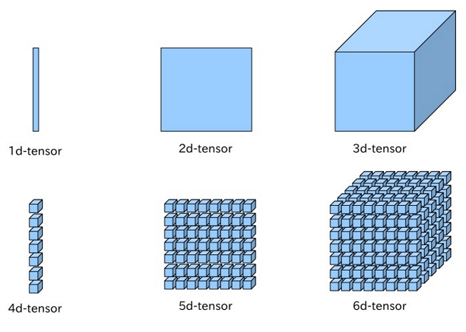

# Assignment 2 - Learning word representations

## Overview
* feed each mini batch of 100 training cases through forward propagation, 
  then use backpropagation to update weights at each layer, 
  updating the weights each time.
* the output layer is a softmax group over the vocabulary, representing
  discrete probabilities of a fourth word.
* the average cross-entropy 
* print out the average cross-entropy error of softmax group over vocabulary units
  at the end of each mini batch and each 100 mini batches. 
  This should decrease as time goes on. 
* network topology
  
  * **input layer**
    * consists of three word indices; it's a 3d vector of int word indices
    * trained in batches of 100
      * each input batch is a matrix of 3 rows and 100 columns by default
      * constitutes 100 training cases of 3 ints corresponding to word indices
    * *bias of units* - unmentioned. presumably zero.
    * each of the 3 units have:
      * 1 input 
      * 1 output
  * **embedding layer**
    * `numhid1` configures the number of units in the embedding 
      layer; default is 50
    * *incoming weights from input layer* are in `word_embedding_weights`
      * initialized with `init_wt * randn(vocab_size, numhid1)`, a matrix 
        of 0 +/- 0.01 with `vocab_size` rows and `numhid1` columns
    * *bias of units* - unmentioned. presumably zero.
    * each of the `numhid1` (50) units have: 
      * 3 inputs from input layer
      * 1 output
  * **hidden layer**
    * `numhid2` configures the number of units in the hidden layer; 
      default is 200
    * *incoming weights from embedding layer* are in `hid_to_output_weights`
      * initialized with `zeros(numhid2, vocab_size);`, a matrix of zeroes
        with `numhid2` rows and `vocab_size` rows. 
      * Note that `word_embedding_weights` has `vocab_size` columns, and 
        `hid_to_output_weights` has `vocab_size` rows.
    * *bias of units* captured in `hid_bias`
      * initialized with `zeros(numhid2, 1);`, a matrix with `numhid2` rows
        and 1 column.
    * each of the `numhid2` (200) units has: 
      * `numhid1` (50) inputs from embedding layer
      * 1 output
  * **output layer**
    * A softmax over the 250 words
    * there are `vocab_size` units; one unit for every word in `vocab`
    * *bias of units* captured in `output_bias`
      * initialized with `zeros(numhid2, 1);`, a matrix with `numhid2` rows
        and 1 column
    * each of the 250 units have:
      `numhid2` (200) inputs from hidden layer
* `load_data(batchsize)`
  * comes from `./raw_sentences.txt`
  * returns `train_input, train_target, valid_input, valid_target,
    test_input, test_target, vocab`
  * `vocab` is a column matrix of one word per row
  * all other vars are matrices whose contents refer to an index within `vocab`
  * these all come from lines of `data.mat`
  * The training set consists of 372,550 4-grams
    * `train_input` and `train_target` are both `[4 x 372,550]` matrices
  * The validation and test sets have 46,568 4-grams each.
    * `valid_input`, `valid_target`, `train_input`, `train_target` are each `[4 x 46,568]`
    * these variables are set up in `load_data.m`
    * validation and test data are each from prepared data in `data.mat`
* For each *epoch* / training iteration:
  * Define a mini-batch of 100 cases from `train_input` and `train_target`
  * Train network on mini-batch
  * Every 100 mini-batches, compute average per-case Cross Entropy (CE)
    obtained on the training set during the 100 mini-batches
  * Every 1000 mini-batches, run on validation set and state that Cross Entropy
* At the end of training, run both on validation set and on test set and
  state cross entropy for each
  

## File Notes

### `train.m` before forward propagation

For each epoch and each mini-batch: 

#### Setup `input_batch`, `target_batch`
```octave
input_batch = train_input(:, :, m);
target_batch = train_target(:, :, m);
```
* `train_input` contains stack of training cases of (`words`, `cases_in_batch`)
  * `m` is the mini-batch number we're focusing on
* `input_batch` contains (`words`, `cases_in_batch`) for the selected mini-batch 
* `target_batch` also contains (`words`, `cases_in_batch`), except it's the target output
  for the input batch, so it's if there are `D` elements in `cases_in_batch`, it's of dimension
  `1xD`.
* `words` here refers to the index of the word in the vocabulary

#### Call forward network propagation
```octave
% FORWARD PROPAGATE.
% Compute the state of each layer in the network given the input batch
% and all weights and biases
[embedding_layer_state, hidden_layer_state, output_layer_state] = ...
  fprop(input_batch, ...
        word_embedding_weights, embed_to_hid_weights, ...
        hid_to_output_weights, hid_bias, output_bias);
```
* `fprop.m` is called, which takes as parameters:
  * `input_batch` described above; 3 rows for each word in training; columns are batch cases
  * `word_embedding_weights`, a vector updated after each run through net
    * initialized to `init_wt * randn(vocab_size, numhid1);`
    * [`randn(vocab_size, numhid1)`](https://www.gnu.org/software/octave/doc/interpreter/Special-Utility-Matrices.html#XREFrandn):
      "Return a matrix with normally distributed random elements having zero mean and variance one. 
      The arguments are handled the same as the arguments for `rand`."
    * returns a matrix of random values from (-1, 1) scaled to `init_wt`, which is `0.01` by default; 
      that way the standard deviation is 1%.
    * `numhid1 = 50;  % Dimensionality of embedding space; default = 50.`
    * each of the 50 embedded layer units store one weight for each word in the vocab
    * `init_wt` is a scalar and `randn` is a matrix that is (`vocab_size`, `50`).
    * `word_embedding_weights` is a matrix where rows correspond to a single word in the vocab 
      and columns are the weights for that word for each of the 50 embedding layer units.
      They are initialized to random values in a normal distribution with standard deviation of
      +/- 0.01 of 0.
  * `embed_to_hid_weights` is initialized `init_wt * randn(numwords * numhid1, numhid2);`
    * one row for each weight stored in `word_embedding_weights`
      * *Q: this surprises me a little bit. does this imply that we have skip layer connections?*
        * we shouldn't, according to the network topology picture
      * *Q: why isn't it one output weight for each neuron in the embedding layer?*
    * one column for each unit in the hidden layer; by default there are 200 columns
    * weights are initialized to random values +/- 0.01 of 0 like `word_embedding_weights`
  * `hid_to_output_weights` is a 200x250 matrix that was initialized with 
    `init_wt * randn(numhid2, vocab_size)`, so it has random values +/- 0.01 of 0
    in the dimensions of 200x250, since by default there are 200 hidden units.
  * `hid_bias` is initialized to `zeros(numhid2, 1);`
    * it's a vector storing a bias for each of the 200 hidden units, by default 0
  * `output_bias` is initialized to `zeros(vocab_size, 1);`
    * it's a vector storing a bias for each of the words in the vocab, by default 0

### `fprop.m` forward propagation
* Compute State of Word Embedding Layer
  ```octave 
  embedding_layer_state = reshape(...
  word_embedding_weights(reshape(input_batch, 1, []),:)',...
  numhid1 * numwords, []);
  ```
  1. `reshape(input_batch, 1, [])`
     * reshape the 3x100 input batch into a 1x300 column matrix so all the words
       are in a row
  2. `word_embedding_weights(reshape(input_batch, 1, []),:)`
     * `word_embedding_weights` is a matrix where rows correspond to one word in vocab
       and columns are the weights for that word for each of 50 embedded feature 
       representation units
     * construct a new matrix by repeatedly selecting and stacking rows from 
       `word_embedding_weights`
     * for each of 300 word indexes in test batch, output the row of 
       50 weights from `word_embedding_weights` corresponding to that word
     * we end up with a 300x50 matrix of all the words in the input batch
       matched with all the weights for each of 50 units
  3. `word_embedding_weights(reshape(input_batch, 1, []),:)'`
     * note the `'` at the end
     * transpose the matrix we got in #2, so now it's 50 rows of weights 
       for 300 columns of input words in this batch
  4. ```octave 
     embedding_layer_state = reshape(...
       word_embedding_weights(reshape(input_batch, 1, []),:)',...
       numhid1 * numwords, []);
     ```
     * **`numwords` (3) is num words in training batch, not to be confused with 
       `vocab_size` (250)**:
        ```octave
        [numwords, batchsize] = size(input_batch);
        [vocab_size, numhid1] = size(word_embedding_weights);
        ```
        * `numwords` is the number of input words in a single training case: 3
     * take the output from #3, which is 50 rows of weights for 300 columns of words, 
       and reshape it into a row matrix 
     * the reshaped matrix has `numhid1 (50) * numwords (3) = 150` rows
     * it's reshaped by stacking three columns from #3 into one row over and over
       * why? because there are three training cases. 
       * **`embedding_layer_state` is a 150x100 matrix where rows are 150 weights
         and columns are training cases consisting of three words at fifty weights per word = 150.**
     * `size(embedding_layer_state)` is 150x100 (using default batch size of 100)
* `COMPUTE STATE OF HIDDEN LAYER`
  * `Compute inputs to hidden units`
  * ```octave
    inputs_to_hidden_units = embed_to_hid_weights' * embedding_layer_state + ...
      repmat(hid_bias, 1, batchsize);
    ```
    * `embed_to_hid_weights` is supplied to `fprop`
      * initialized to: `zeros(numwords * numhid1, numhid2)` =
        `zeros(3 * 50, 200)` = matrix of zeros that's 150 rows by 200 columns.
        * there's a data point mapping each weight in the embedding layer to a hidden node
    * transposition `embed_to_hid_weights'` is 200 rows by 150 columns, so rows are 
      hidden layer nodes and columns are embedding layer nodes, and values are the weights
      on the connections coming into the hidden layer from the embedding layer
    * `embed_to_hid_weights'` (200x150) by `embedding_layer_state` (150x100) 
    * `size(embed_to_hid_weights' * embedding_layer_state)` is 200x100
    * [`repmat (A, m, n)`](https://www.gnu.org/software/octave/doc/v4.0.1/Special-Utility-Matrices.html#XREFrepmat):
      * "Form a block matrix of size m by n, with a copy of matrix A as each element."
      * "If n is not specified, form an m by m block matrix. For copying along more 
        than two dimensions, specify the number of times to copy across each dimension 
        m, n, p, …, in a vector in the second argument."
      * it sounds like `repmat` creates a tensor by repeating a matrix inside its cells?
        
      * ``` 
        octave:67> A=2;
        octave:68> repmat(A,2,3)
        ans =
        
           2   2   2
           2   2   2
        octave:69> A = [1, 2];
        octave:70> repmat(A, 2, 3)
        ans =
        
           1   2   1   2   1   2
           1   2   1   2   1   2
        octave:71> A = [1; 2];
        octave:72> repmat(A, 2, 3)
        ans =
        
           1   1   1
           2   2   2
           1   1   1
           2   2   2
        ```
      * From the gnu docs description, I thought it was embedding a dimension inside
        each cell, but that's incorrect. It's just using the first parameter
        as the template for the 2d matrix and repeating it a number of rows and columns
        according to the 2nd and 3rd parameters
    * `repmat(hid_bias, 1, batchsize)`
      * The hidden layer bias is initialized to `zeros(numhid2, 1)`, which is 
        `numhid2` (200) rows by 1 column of zeroes
      * We're taking a 200x1 matrix of zeroes and repeating it only one time vertically
        but repeating it `batchsize` (100) times horizontally, so we have a matrix
        that is 200x100. The rows are hidden units and the columns are test cases, and the
        values are the biases of each hidden layer unit.
    * `inputs_to_hidden_units` could just as easily have been `embedded_layer_outputs`. 
    * it's a computation of multiplying embedded weights by embedded inputs and adding the 
      biases; the embedding layer is just simple linear neurons.
    * `inputs_to_hidden_units` dimensions are `200x100` hidden units by training cases, 
      where each value is the logit of the activation function
  * `% Apply logistic activation function.`
    * `hidden_layer_state = 1 ./ (1 + exp(-inputs_to_hidden_units));`
    * `x ./ y`: "Element-by-element right division"
      * ``` 
        You cannot use / to divide two matrices element-wise, since /
        and \ are reserved for left and right matrix "division". Instead, you
        must use the ./ function:
        octave:6> x = [1, 2, 3]; y = [5, 6, 2]; y./x
           5.00000   3.00000   0.66667
        octave:7> 1 ./ x
           1.00000   0.50000   0.33333
        ```
      * *Q: why is the operation `./` called "right division?"*
    * Here we're implementing the logistic activation function: 
      * $$ z=b+\sum_i x_i w_i $$
        * this is already computed in `inputs_to_hidden_units`
      * $$ y=\frac{1}{1+e^{-z}} $$
        * this is `1 ./ (1 + exp(-inputs_to_hidden_units))`
    * In Octave, we can do this on a matrix variable end up with a matrix,
      and the equation looks just like we did it on one unit
    * `hidden_layer_state` then contains the outputs of the hidden layer units;
      it's output is also 200x100 hidden layer units by 100 training cases in batch
* `%% COMPUTE STATE OF OUTPUT LAYER.`
  * `% Compute inputs to softmax.`
    * `inputs_to_softmax = hid_to_output_weights' * hidden_layer_state + repmat(output_bias, 1, batchsize);
  `
    * `hid_to_output_weights` was passed as an argument to `fprop`. It's a 
      `numhid2 X vocab_size` (200, 250) matrix where where the datapoints are the weights of
      the connections between the `numhid2` (200) hidden layer units and the `vocab_size` (250)
      output units. It was initialized to `init_wt * randn(numhid2, vocab_size)`, so at the start
      its weights are 0 +/- 0.01 random values. 
    * `hid_to_output_weights' * hidden_layer_state` is 250x200 * 200x100 = 250x100 matrix representing
      the weighted sum of the inputs from the hidden layer for the output layer unit logits. 
    * `repmat(output_bias, 1, batchsize)` is the bias for output layer unit logits.
    * `inputs_to_softmax` is `vocab size (250) X batch size (200)` and contains output layer logits
  * `% Subtract maximum.` 
    * *"Remember that adding or subtracting the same constant from each input to a
      softmax unit does not affect the outputs. Here we are subtracting maximum to
      make all inputs <= 0. This prevents overflows when computing their exponents."*
    * `inputs_to_softmax = inputs_to_softmax - repmat(max(inputs_to_softmax), vocab_size, 1);`
    * Here we are subtracting the same constant from all logits to make all of them <= 0
    * the claim is that this prevents overflows when computing their exponents
    * Softmax output: $$ y_i = \frac{e^{z_i}}{\sum_{j \in group} e^{z_j}} $$
    * since the inputs are connected to the exponent, Hinton makes it sound like there is a 
      risk of buffer overflow if the inputs are big. This might be just a performance optimization 
      or something he is used to from working with production data.
  * `% Compute exp.`
    * `output_layer_state = exp(inputs_to_softmax);`
    * first, we get the numerator
  * `% Normalize to get probability distribution.`
    * now that we have the softmax numerator, we can get the denominator
    * ```octave 
      output_layer_state = output_layer_state ./ repmat(...
        sum(output_layer_state, 1), vocab_size, 1);
      ```
    * `sum(output_layer_state, 1)`
      * in the softmax equation, the denominator is the sum of all the logits
      * `output_layer_state` has dimensions `vocab_size (250) X batch_size (100)`
      * sum with 1 as the second parameter sums along columns / training batches
      * we get a 1 x 100 matrix out, where each column is the sum across the vocab 
      * of all the output logits
    * `repmat(sum(output_layer_state, 1), vocab_size, 1)`
      * Here, we repeat the 1x100 matrix `vocab_size (250)` times so we end up
        with a `250x100` matrix where in each column / training case all of the values 
        are the same, equal to the sum of the logits for that training case.
    * `output_layer_state` ends up containing the outputs of the 250 words, 
      each with a probability of that word
* `fprop` returns `embedding_layer_state`, `hidden_layer_state`, `output_layer_state`
  * `embedding_layer_state`: "State of units in the embedding layer as a matrix of
    size `numhid1*numwords X batchsize`"
    * each of the `numhid1` units (50) in the embedding layer has `numwords` (3) weights
      for each of the `batchsize` (100) training cases
  * `hidden_layer_state`: "State of units in the hidden layer as a matrix of size
    `numhid2 X batchsize`"
    * one row for each hidden layer unit 
    * one column for each training case in the mini-batch
    * values are the output of the hidden layer units
  * `output_layer_state`: "State of units in the output layer as a matrix of size
     `vocab_size X batchsize`"
     * one row for each word in the vocabulary
     * one column for each training case in mini-batch
     * values are the discrete proabilities of each word in the vocab; the output
       of the activation function
   
   
### `train.m` after forward propagation

#### Compute Derivative
```octave
% COMPUTE DERIVATIVE.
%% Expand the target to a sparse 1-of-K vector.
expanded_target_batch = expansion_matrix(:, target_batch);
%% Compute derivative of cross-entropy loss function.
error_deriv = output_layer_state - expanded_target_batch;
```
* this all comes from lecture 4, where we talked about the derivative of 
  the Cost $$ C $$ w.r.t. the logit $$ z $$, which is $$ y_i - t_i $$ for each $$ i $$.
* [sparse matrix](https://en.wikipedia.org/wiki/Sparse_matrix)
* `expanded_target_batch = expansion_matrix(:, target_batch);`
  * `target_batch` is `[1x100]`; one word for the target of each training case in the
    batch
  * `expansion_matrix` is initialized to `eye(vocab_size)`, which is a 
    `vocab_size` by `vocab_size` square identity matrix.
    * the first matrix index `:` returns all of the rows
    * the second matrix index `target_batch` is `[1x100]` where values
      are indexes of 
    are `1xNumCasesInBatch`.
  * I have not yet mastered Octave's indexing notation enough to interpret
    the `expansion_matrix`.
  * reviewing [*A Programmer's Guide to Octave*](http://www.i-programmer.info/programming/other-languages/4779-a-programmers-guide-to-octave.html?start=1),
    * *Vector Index* to a matrix:
      > A vector of indexes just picks out the combined set of elements 
      > that each index would pick out. For example, `A([1,2],1)`
      > picks out `A(1,1)` and `A(2,1)` and the result is a column vector 
      > because you have specified part of a column of the original matrix.
    * *Range Index* to a matrix: 
      > In general a range is specified as `start:increment:end`
      > and if you leave out the increment it is assumed to be 1 and the range is
      > `start:end`. The increment can be negative.
  * by typing in variables into the REPL, I can see that `train_batch` is a `1x100` matrix
    of word indexes in the vocab. 
  * `expansion_matrix(:, target_batch)` will return a matrix with all rows of the 
    `vocab_size x vocab_size` matrix, and only those columns selected in the target_batch.
  * ```octave
    octave:62> size(expanded_target_batch)
    ans =
    
       250   100
    ```  
* `output_layer_state` is also 250x100, so we can subtract `expanded_target_batch` from it
* what does it mean to do so, though?
* `output_layer_state` has the outputs, which are supposed to be softmax, so each 
  should be between zero and one. 
* `expanded_target_batch` is pretty subtle; this isn't a technique I've seen before. 
  It is all zeroes except for one 1 where the row equals the column,
  but we pass in a vector of indexes into the vocab in order of the training batches, 
  with the result that we end up with a list of rows where at the index of the correct
  word, we get a 1 for the correct word.
  * the thing that's weird about it is how we can construct a matrix by passing in a vector of 
    indexes, and there may be repeats in the indexes, so as a result, certain words
    may appear more than once.
  * example: if I have a vocabulary set of ["a", "b", "c"], and then 
    I make a `expansion_matrix` identity:
    ```
    1 0 0
    0 1 0
    0 0 1
    ```
    then if I have a batch of 5 training answers corresponding to indexes in the vocabulary:
    `target_batch = [1, 3, 2, 2, 1]`, then if I do `expansion_matrix(:, target_batch)`,
    I will get `expanded_target_batch`:
    ``` 
    1 0 0 0 1
    0 0 1 1 0
    0 1 0 0 0
    ```
    and this `expanded_target_batch` can then be used as a kind of mask 
  * I believe what it's doing is making it so that for each training case column, there is 
    exactly one 1 in the row equal to the word that is selected for that row.
* `error_deriv = output_layer_state - expanded_target_batch;`
  * here, we're using the fact that $$\frac{\delta C}{\delta z_i}=y_i-t_i$$.
  * this is from lecture 4 slide, "Cross-entropy: the right cost function to use with softmax"

#### Measure Loss Function
```octave
% MEASURE LOSS FUNCTION.
CE = -sum(sum(...
  expanded_target_batch .* log(output_layer_state + tiny))) / batchsize;
trainset_CE = trainset_CE + (CE - trainset_CE) / m;
count =  count + 1;
this_chunk_CE = this_chunk_CE + (CE - this_chunk_CE) / count;
fprintf(1, '\rBatch %d Train CE %.3f', m, this_chunk_CE);
if mod(m, show_training_CE_after) == 0
  fprintf(1, '\n');
  count = 0;
  this_chunk_CE = 0;
end
```
* `CE = -sum(sum(expanded_target_batch .* log(output_layer_state + tiny))) / batchsize;`
  * `tiny` is initialized to `exp(-30)`
  * [`log(x)`](https://www.gnu.org/software/octave/doc/interpreter/Exponents-and-Logarithms.html#XREFlog) computes
   the log of x *for all x*
  * `log(output_layer_state + tiny)` gives a `vocab_size x batch_size = 250x100` matrix 
    where each element is `log(state_for_unit + tiny)`.
  * we're talking about the output layer softmax here
  * in octave `.*` means element by element multiplication, so 
    `expanded_target_batch .* ↑↑↑` then gives a matrix produced by 
    multiplying `expanded_target_batch__{ij} x ↑↑↑__{ij}`. 
    * What does this mean? Zeroes in the expanded targets eliminate
      the effect of the output layer state, and exactly one output layer
      state effect from each column survives.
    * We get a 250x100 matrix, where in each of 100 columns, at most one row's value 
      is non-zero.
  * `-sum(sum(...`: see [`sum(x)`](https://www.gnu.org/software/octave/doc/interpreter/Sums-and-Products.html#XREFsum)
    "Sum of elements along dimension dim. If dim is omitted, it defaults 
    to the first non-singleton dimension." 
    * I have no idea what a non-singleton dimension is in this context. I could assume
      that it means that in a `n-tensor`, the first dimension of the tensor is the "rightmost"
      in the vector statement.
    * I've read [elsewhere](http://www.obihiro.ac.jp/~suzukim/masuda/octave/html3/octave_102.html)
      that it defaults to "1 (column-wise sum)", 
    * This appears to be validated by the following experiment:
      ``` 
      octave:75> A = [1,2,3; 4,5,6; 7,8,9]
      octave:76> sum(A)
      ans =
      
         12   15   18
      octave:77> -sum(sum(A))
      ans = -45
      ```
  * For `m=1` I get `CE = 5.5215`.
  * The loss function is cross entropy:
    $$ C = -\sum_j t_j log{y_j} $$
    * lecture 4 slide, "Cross-entropy: the right cost function to use with softmax"
  * Here we've computed it for a batch, so that's why it's divided by the batch size;
    we essentially have one portion of the cost function computed at each batch
* `trainset_CE = trainset_CE + (CE - trainset_CE) / m;`
  * `trainset_CE`: the cross entropy for the whole training set across all batches. Reset
    to zero at the beginning of an epoch. 
  * I think you can see this as the cumulative effect of adding the change in cross entropy. 
  * We take the difference between this batch's cross entropy and the training set's 
    cross entropy, (the rise) over the number of batches (the run) to get the delta 
    in CE relative to what it was. Then we accumulate that delta in the current value.
* ```octave
  count =  count + 1;
  this_chunk_CE = this_chunk_CE + (CE - this_chunk_CE) / count;
  fprintf(1, '\rBatch %d Train CE %.3f', m, this_chunk_CE);
  if mod(m, show_training_CE_after) == 0
    fprintf(1, '\n');
    count = 0;
    this_chunk_CE = 0;
  end
  ```
  * this chunk can be ignored. It's just used for printing the 
    intermediate effects every 100 batches.

#### Back Propagate - Output Layer
```octave
hid_to_output_weights_gradient =  hidden_layer_state * error_deriv';
output_bias_gradient = sum(error_deriv, 2);
back_propagated_deriv_1 = (hid_to_output_weights * error_deriv) .* hidden_layer_state .* (1 - hidden_layer_state);
```
1. `hid_to_output_weights_gradient =  hidden_layer_state * error_deriv';`
   * `error_deriv` holds `output_layer_state - expanded_target_batch`, a matrix of 250x100
     * `error_deriv'` is the transpose, so a matrix of 100x250
   * `hidden_layer_state` holds 250x100, where rows are words and cols are training 
     cases in batch
   * so `hid_to_output_weights_gradient` is regular matrix mult of the two. 
2. `output_bias_gradient = sum(error_deriv, 2);`
   * `error_deriv` is 250x100, which is the rate of change of the loss func for 
     250 words x 100 training cases
   * `A = [1, 2; 3, 4]; sum(A, 2)` gives 
     ``` 
     3
     7
     ```
     so this means that `sum(error_deriv, 2)` should give a row matrix where each row
     contains the sum of the error derivatives for that word in the mini batch.
     This is what is in `output_bias_gradient`
3. `back_propagated_deriv_1 = (hid_to_output_weights * error_deriv) .* hidden_layer_state .* (1 - hidden_layer_state);`
   * `(hid_to_output_weights * error_deriv)`
     * `hid_to_output_weights` is a 200x250 rand 0 +/- 0.01 matrix initially
     * mult by error_deriv, we get 200x250 * 250x100 = 200x100 matrix
   * we can understand this line if we go to lec3 slide "Backpropagating dE/dy"
     $$ \frac{\delta E}{\delta z_j}=y_j(1-y_j)\frac{\delta E}{\delta y_j} $$
   * `(hid_to_output_weights * error_deriv)` is $$ \frac{\delta E}{\delta y_j} $$
   * `hidden_layer_state .* (1 - hidden_layer_state);` is $$ y_j(1-y_j) $$

##### Back Propagate - Hidden Layer
```octave
%% HIDDEN LAYER.
embed_to_hid_weights_gradient = embedding_layer_state * back_propagated_deriv_1';
hid_bias_gradient = sum(back_propagated_deriv_1, 2);
back_propagated_deriv_2 = embed_to_hid_weights * back_propagated_deriv_1;
```
* `embed_to_hid_weights_gradient = embedding_layer_state * back_propagated_deriv_1';`
  * 


## Instructions

In this assignment, you will design a neural net language model that will
learn to predict the next word, given previous three words.

The data set consists of 4-grams (A 4-gram is a sequence of 4 adjacent words
in a sentence). These 4-grams were extracted from a large collection of text.
The 4-grams are chosen so that all the words involved come
from a small vocabulary of 250 words. Note that for the purposes of this
assignment special characters such as commas, full-stops, parentheses etc
are also considered words. The training set consists of 372,550 4-grams. The
validation and test sets have 46,568 4-grams each.

### GETTING STARTED
Look at the file raw_sentences.txt. It contains the raw sentences from which
these 4-grams were extracted. Take a look at the kind of sentences we are
dealing with here. They are fairly simple ones.

To load the data set, go to an octave terminal and cd to the directory where the
downloaded data is located. Type

`> load data.mat`

This will load a struct called 'data' with 4 fields in it.
You can see them by typing

`> fieldnames(data)`

'data.vocab' contains the vocabulary of 250 words. Training, validation and
test sets are in 'data.trainData', 'data.validData' and 'data.testData'  respectively.
To see the list of words in the vocabulary, type -

`> data.vocab`

'data.trainData' is a matrix of 4x372550 rows vs columns. This means there are 372550
training cases and 4 words per training case. Each entry is an integer that is
the index of a word in the vocabulary. So each column represents a sequence of 4
words. 'data.validData' and 'data.testData' are also similar. They contain
46,568 4-grams each. All three need to be separated into inputs and targets
and the training set needs to be split into mini-batches. The file load_data.m
provides code for doing that. To run it type:

`>[train_x, train_t, valid_x, valid_t, test_x, test_t, vocab] = load_data(100);`

> Apparently Octave has destructuring. We get load_data by being in
> the same directory as `load_data.m`, whose sole contents is the 
> function that is run. After this is run, train_t is a variable in the space that
> called `load_data`.
> 
> Reading through `load_data.m`, the function is terminated with the `end`
> keyword. In octave, instead of a `return` statement, when declaring the function, 
> the signature declares the names of the variables that should be returned.
> These are the variables destructured in the call listed here.
>
> There are several octave system functions called in this function. They are 
> not imported via any syntax that I can see; instead, they are assumed to be
> in scope: 
> 
> `size(data.trainData, 2)`: [size](https://www.gnu.org/software/octave/doc/interpreter/Object-Sizes.html#Object-Sizes)
> returns "a row vector with the size (number of elements) of each dimension for 
> the object a in `size(a)`. When given a second argument, dim, return the size 
> of the corresponding dimension." So here, given a 4x372550 matrix, 
> `size(data.trainData, 1) -> 4` and `size(data.TrainData, 2) -> 372550`.
>
> `train_input = reshape(data.trainData(1:D, 1:N * M), D, N, M);`: [reshape](https://www.gnu.org/software/octave/doc/v4.0.3/Rearranging-Matrices.html)
> `Built-in Function: reshape (A, m, n, …)` - "Return a matrix with the specified 
> dimensions (m, n, …) whose elements are taken from the matrix A."
> `D` here is `size(data.trainData, 1)-1`, which is `3`. `N` was passed as
> the batch size, and `M` is the number of batches in the columns, which is 3725. 
> So `N*M` is 372500. 
> `data.trainData(1:D, 1:N * M)` selects rows 1-3 and columns 1-372500.
> Note here that a range specifier of all values from 1:D (here: 3) is passed to the first 
> parameter to select. Then we "reshape" that into `DxNxM = 3x100x3725`. 
> I assume that it goes in columns then rows when reshaping. This is what 
> determines the var `train_input`.

This will load the data, separate it into inputs and target, and make
mini-batches of size 100 for the training set.

`train.m` implements the function that trains a neural net language model.
To run the training, execute the following -

`> model = train(1);`

> `train` makes a call to `load_data`. 
> [`randn`](https://www.gnu.org/software/octave/doc/interpreter/Special-Utility-Matrices.html#XREFrandn)
> "Return a matrix with normally distributed random elements having zero mean and variance one.
> The arguments are handled the same as the arguments for rand."
> [`zeros`](https://www.gnu.org/software/octave/doc/interpreter/Special-Utility-Matrices.html#XREFzeros)
> "Return a matrix or N-dimensional array whose elements are all 0."
> [`eye`](https://www.gnu.org/software/octave/doc/interpreter/Special-Utility-Matrices.html)
> "Return an identity matrix. If invoked with a single scalar argument n, 
> return a square NxN identity matrix."
> [`exp`](https://www.gnu.org/software/octave/doc/interpreter/Exponents-and-Logarithms.html)
> "Compute e^x for each element of x."
> [`fprintf`](https://www.gnu.org/software/octave/doc/v4.0.0/Formatted-Output.html#XREFfprintf)
> "This function is equivalent to printf, except that the output is written to the 
> file descriptor fid instead of stdout. printf: Print optional arguments under the 
> control of the template string template to the stream stdout and return the number 
> of characters printed."


This will train the model for one epoch (one pass through the training set).
Currently, **the training is not implemented and the cross entropy will not
decrease**. **You have to fill in parts of the code in `fprop.m` and `train.m`**.

> `fprop.m` contains the forward propagation function.

Once the code is correctly filled-in, you will see that the cross entropy
starts decreasing. At this point, **try changing the hyperparameters (number
of epochs, number of hidden units, learning rates, momentum, etc)** and see
what effect that has on the training and validation cross entropy. The
questions in the assignment will ask you try out specific values of these.

The training method will **output a 'model' (a struct containing weights, biases
and a list of words)**. Now it's time to play around with the learned model
and answer the questions in the assignment.

### DESCRIPTION OF THE NETWORK
The network consists of an **input layer, embedding layer, hidden layer and output
layer**. The input layer consists of three word indices. The same
`word_embedding_weights` are used to map each index to a distributed feature
representation. These mapped features constitute the embedding layer. This layer
is connected to the hidden layer, which in turn is connected to the output
layer. The output layer is a softmax over the 250 words.

### THINGS YOU SEE WHEN THE MODEL IS TRAINING
As the model trains it prints out some numbers that tell you how well the
training is going.


OUTPUT:
```text
octave:18> model = train(1);
Epoch 1
Batch 100 Train CE 5.521
Batch 200 Train CE 5.521
Batch 300 Train CE 5.521
...
Running validation ... Validation CE 5.521
Batch 1100 Train CE 5.521
Batch 1200 Train CE 5.521
Batch 1300 Train CE 5.521
...

Average Training CE 5.521
Finished Training.
Final Training CE 5.521
Final Validation CE 5.521
Final Test CE 5.521
Training took 32.49 seconds

```

1. The model shows the average per-case cross entropy (CE) obtained
   on the training set. The average CE is computed every 100 mini-batches. The
   average CE over the entire training set is reported at the end of every epoch.
2. After every 1000 mini-batches of training, the model is run on the
   validation set. Recall, that the **validation set consists of data that is not
   used for training**. It is used to see **how well the model does on unseen data**. 
   The cross entropy on validation set is reported.
3. At the end of training, the model is run **both on the validation set and on
   the test set and the cross entropy on both is reported**.

You are welcome to change these numbers (100 and 1000) to see the CE's more
frequently if you want to.


### SOME USEFUL FUNCTIONS
These functions are meant to be used for analyzing the model *after* the training
is done.

* `display_nearest_words.m`: This method will display the words closest to a
   given word in the word representation space.
* `word_distance.m`: This method will compute the distance between two given
   words.
* `predict_next_word.m`: This method will produce some predictions for the next
   word given 3 previous words.

Take a look at the documentation inside these functions to see how to use them.


### THINGS TO TRY
Choose some words from the vocabulary and make a list. Find the words that
the model thinks are close to words in this list (for example, find the words
closest to 'companies', 'president', 'day', 'could', etc). Do the outputs make
sense?

Pick three words from the vocabulary that go well together (for example,
'government of united', 'city of new', 'life in the', 'he is the' etc). Use
the model to predict the next word. Does the model give sensible predictions?

Which words would you expect to be closer together than others? For example,
'he' should be closer to 'she' than to 'federal', or 'companies' should be
closer to 'business' than 'political'. Find the distances using the model.
Do the distances that the model predicts make sense?

You are welcome to try other things with this model and post any interesting
observations on the forums!
