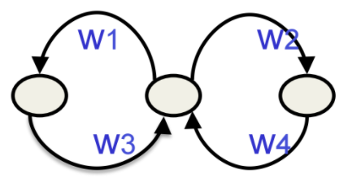
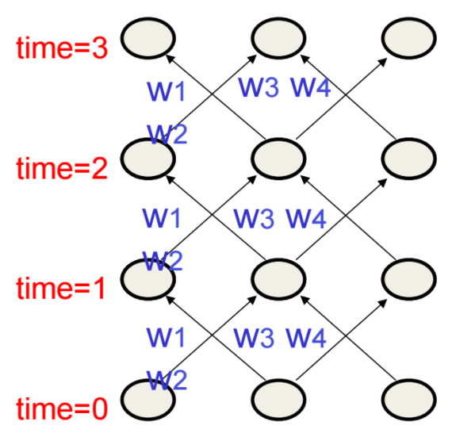
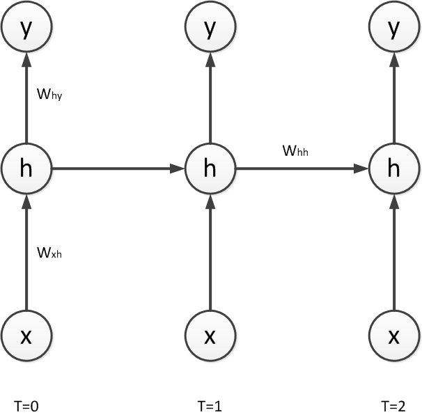

# Week 7 - Modeling Sequences with RNNs

## 7a - Modeling sequences: A brief overview
### 7a-02 - Getting targets when modeling sequences
### 7a-03 - Memoryless models for sequences
### 7a-04 - Beyond memoryless models
### 7a-05 - Linear Dynamical Systems (engineers love them!)
### 7a-06 - Hidden Markov Models (computer scientists love them!)
### 7a-07 - A fundamental limitation of HMMs
### 7a-08 - Recurrent neural networks
### 7a-09 - Do generative models need to be stochastic?
### 7a-10 - Recurrent neural networks

## 7b - Training RNNs with backpropagation
### 7b-02 - The equivalence between feedforward nets and recurrent nets

* assume that there is a time delay of 1 in using each connection
* the recurrent net is just a layered net that **keeps reusing the same weights**.

### 7b-03 - Reminder: Backpropagation with weight constraints
* it is easy to modify backprop to incorporate constraints between weights
* compute gradients as usual then modify them so they satisfy constraints
* if they started off satisfying them, they will continue to satisfy them
* to constrain $$ w_{1,\text{t=0}} = w_{1,\text{t=1}} $$
* we need: $$ \Delta w_{1,\text{t=0}} = \Delta w_{1,\text{t=1}} $$
* compute: $$ \frac{\partial E}{\partial w_{1,\text{t=0}}} \text{and} \frac{ \partial E }{ \partial w_{1,\text{t=1}} } $$
* then, use $$ \frac{\partial E}{\partial w_{1,\text{t=0}}} + \frac{ \partial E }{ \partial w_{1,\text{t=1}} } $$
  for both $$ w_{1,\text{t=0}} $$ and $$ w_{1,\text{t=1}} $$.

### 7b-04 - Backpropagation through time

Training algorithm in the time domain:

– The forward pass builds up a stack of the activities of all
  the units at each time step.
– The backward pass peels activities off the stack to
  compute the error derivatives at each time step.
– After the backward pass we add together the derivatives at
  all the different times for each weight.

### 7b-05 - An irritating extra issue
### 7b-06 - Providing input to recurrent networks
### 7b-07 - Teaching signals for recurrent networks

## 7c - A toy example of training an RNN
### 7c-02 - A good toy problem for a recurrent network
### 7c-03 - The algorithm for binary addition
### 7c-04 - A recurrent net for binary addition
### 7c-05 - The connectivity of the network
### 7c-06 - What the network learns
* RNNs can emulate finite state automaton, but they are more powerful than FSAs
  * with N hidden neurons, it has $$ 2^N $$ binary activity vectors
  * it still has only $$ N^2 $$ weights
  * when the imput stream has two things going on at once, this "is important"
  * A finite state automaton "needs to square its number of states"
  * An RNN "needs to double it's number of units"

## 7d - Why it is difficult to train an RNN
### 7d-02 - The backward pass is linear
### 7d-03 - The problem of exploding or vanishing gradients
### 7d-04 - Why the back-propagated gradient blows up
### 7d-05 - Four effective ways to learn an RNN

## 7e - Long term short term memory
### 7e-02 - Long Short Term Memory (LSTM)
### 7e-03 - Implementing a memory cell in a neural network
### 7e-04 - Backpropagation through a memory cell
* At initial time, let's assume that keep gate is 0 and write gate is 1
* value of 1.7 from rest of NN is set to 1.7. 

### 7e-05 - Reading cursive handwriting
* natural task for RNN
* usually, input is sequence of (x, y, p) coordinates of the tip 
  of the pen, where p indicates pen up or pen down
* output is sequence of characters.

### 7e-06 - A demonstration of online handwriting recognition by an RNN with Long Short Term Memory
* from Alex Graves
* [movie demo](https://www.youtube.com/watch?v=mLxsbWAYIpw):
* **Row 1**: This shows when the characters are recognized.
  – It never revises its output so difficult decisions are more delayed.
* **Row 2**: This shows the states of a subset of the memory cells.
  – Notice how they get reset when it recognizes a character.
* **Row 3**: This shows the writing. The net sees the x and y coordinates.
  – Optical input actually works a bit better than pen coordinates.
* **Row 4**: This shows the gradient backpropagated all the way to the x and
  - y inputs from the currently most active character.
  – This lets you see which bits of the data are influencing the decision.

# Week 7 Quiz

## Week 7 Quiz - Q1
1. How many bits of information can be modeled by the vector of hidden activities 
   (at a specic time) of a Recurrent Neural Network (RNN) with 16 logistic hidden
   units?
   1. `2`
   1. `4`
   1. `16`
   1. `>16`
2. How many bits of information can be modeled by the hidden state (at some specific
   time) of a Hidden Markov Model with 16 hidden units?
   1. `2`
   1. `4`
   1. `16`
   1. `>16`

*Q1 Notes*
* **7c-06 - What the network learns**
  * "an RNN with *n* hidden neurons has $$ 2^{n} $$ possible binary activity 
    vectors (but only $$ n^{2} $$ weights)" 
  * "A finite state automaton needs to square its number of states" while
    "An RNN needs to double its number of units." 
* With Q1-1, the vector of hidden activities "has $$ 2^n $$ possible binary
  activity vectors" which is much greater than 16.
* With Q1-2, an HMM represents its states with integers. For example, if 
  there are 16 possible states, it takes 4 bits to represent those 16 states, 
  since $$ 2^4 $$ is 16. 
  * Does this imply that HMMs usually have the same number of internal states
    as the number of hidden units? There is unexplained context to this question
    that I'm not picking up.
  * [forum post *Difference between HMM and RNN*](https://www.coursera.org/learn/neural-networks/discussions/weeks/7/threads/g0s31eyMEeaq4BIsWS_kSA)
    * > The state vector of an HMM is generated from a multinomial probability distribution over N state values--that's why it can only carry log2N bits of information. The state vector of an RNN with logistic hidden activations is generated from N probability distributions over binary state values.
    * > RNNs can have dedicated outputs leaving the hidden states a black box whereas in HMMs the states are usually assigned interpretations ahead of time. In an HMM you can incorporate long-term dependencies by explicitly representing them in the the states and transitions leading to very large and sparse transition matrices--very typical in speech and language processing. Leaving the hidden states a black box allows the model to learn to encode long-term information on its own.

## Week 7 Quiz - Q2
This question is about speech recognition. To accurately recognize what phoneme 
is being spoken at a particular time, one needs to know the sound data from 
100ms before that time to 100ms after that time, i.e. a total of 200ms of 
sound data. Which of the following setups have access to enough sound data 
to recognize what phoneme was being spoken 100ms into the past?
  1. A feed forward Neural Network with 200ms of input
  2. A Recurrent Neural Network (RNN) with 200ms of input
  3. A feed forward Neural Network with 30ms of input
  4. A Recurrent Neural Network (RNN) with 30ms of input

*Q2 Notes*
* it's only recurrent neural networks that can reasonably simulate a finite state
  automaton by storing information

## Week 7 Quiz - Q3
The figure below shows a Recurrent Neural Network (RNN) with one input unit x, one 
logistic hidden unit $$ h $$, and one linear output unit $$ y $$. The RNN is unrolled 
in time for T=0, 1, and 2.

The network parameters are: $$ W_{xh}=0.5 $$, $$ W_{hh}=-1.0 $$, $$ W_{hy}=-0.7 $$, 
$$ h_{bias}=-1.0 $$, and $$ y_{bias}=0.0 $$. Remember, 
$$ \sigma(k) = \frac{1}{1+\exp(-k)} $$. 

If the input $$ x $$ takes the values 9, 4, -2 at the time steps 0, 1, 2 respectively,
what is the value of the hidden state $$ h $$ at $$ T=2 $$? Give your naswer with at 
least two digits after the decimal point.

### Week 7 Quiz - Q3 Work

[include](./prob3.m)

## Week 7 Quiz - Q4
The figure below shows a Recurrent Neural Network (RNN) with one input unit x, one 
logistic hidden unit h, and one linear output unit.  The RNN is unrolled in time for 
T=0, 1, and 2.

The network parameters are: $$ W_{xh} =−0.1 $$, $$ W_{hh}=0.5 $$, $$ W_{hy}=0.25 $$, 
$$ h_{bias}=0.4 $$, and $$ y_{bias}=0.0 $$.

If the input x takes the values 18, 9, −8 at time steps 0, 1, 2 respectively, the 
hidden unit values will be 0.2, 0.4, 0.8 and the output unit values will be 
0.05, 0.1, 0.2 (you can check these values as an exercise).

A variable z is defined as the total input to the hidden unit before the logistic 
nonlinearity.

If we are using squared error loss with targets t0 = 0.1, t1 = -0.1, t2 = -0.2, 
what is the value of the error derivative just before the hidden unit nonlinearity 
at T=2 (i.e. $$ \frac{\delta E}{\delta z_2} $$)? Write your answer up to at least 
the fourth decimal place.

### Week 7 Quiz - Q4 Work

I've adapted `prob3.m` to prob4's parameters: 

[include](./prob4.m)

Plan: backpropagate to find $$ \frac{ \partial E }{ \partial z_1 } $$.

$$
\frac{ \partial E }{ \partial z_1 } = 
\frac{ \partial E_1 }{ \partial z_1 } + 
\frac{ \partial E_2 }{ \partial z_1 } 
$$

Expanding E1 w.r.t. z1:
$$
\frac{ \partial E_1 }{ \partial z_1 } = 
\frac{ \partial E   }{ y_1          }
\frac{ \partial y_1 }{ \partial h_1 }
\frac{ \partial h_1 }{ \partial z_1 }
$$

Expanding E2 w.r.t. z1
$$
\frac{ \partial E_2 }{ \partial z_1 } = 
\frac{ \partial E_2 }{ \partial y_2 }
\frac{ \partial y_2 }{ \partial h_2 }
\frac{ \partial h_2 }{ \partial z_2 }
\frac{ \partial z_2 }{ \partial h_1 }
\frac{ \partial h_1 }{ \partial z_1 }
$$

#### E1 w.r.t. z1

We are using squared error, which means that for each output unit, the 
error is computed as one half the square of the residual, which is the 
difference between the target output and the actual output for the unit:

$$ 
E_{ j \in \text{all output units} } = \frac{ 1 }{ 2 }(t_j - y_j)^{2}
$$

So by the chain rule and the power rule,

$$
\frac{ \partial E_j }{ \partial y_j } = y_j - t_j
$$

$$
\frac{ \partial E_1 }{ \partial z_1 } = 
(y_1 - t_1)
\frac{ \partial y_1 }{ \partial h_1 }
\frac{ \partial h_1 }{ \partial z_1 }
$$

Next, $$ \frac{ \partial y_1 }{ \partial h_1 } = W_{hy} $$; the derivative of 
y1 w.r.t. the hidden unit 1 activation is just the weight connecting h1 to
y1:

$$
\frac{ \partial E_1 }{ \partial z_1 } = 
(y_1 - t_1) * 
W_{hy} *
\frac{ \partial h_1 }{ \partial z_1 }
$$

Finally, $$ \frac{ \partial h_1 }{ \partial z_1 } $$ is the logistic 
function derivative w.r.t. the logit, $$ h_1(1 - h_1) $$. For a review of this, 
see week 3's slide, "The derivatives of a logistic neuron."

$$
\frac{ \partial E_1 }{ \partial z_1 } = 
(y_1 - t_1) * 
W_{hy} *
h_1(1 - h_1)
$$

Given that $$ y_1 = 0.1 $$, $$ t_1 = -0.1 $$, $$ W_{hy} = 0.25 $$, $$ h_1 = 0.4 $$:
$$
\frac{ \partial E_1 }{ \partial z_1 } = 
(0.1 - -0.1) * 
0.25 *
0.4(1 - 0.4)
$$

$$
\frac{ \partial E_1 }{ \partial z_1 } = 0.012026
$$

#### E2 w.r.t. z1
$$
\frac{ \partial E_2 }{ \partial z_1 } = 
\frac{ \partial E_2 }{ \partial y_2 }
\frac{ \partial y_2 }{ \partial h_2 }
\frac{ \partial h_2 }{ \partial z_2 }
\frac{ \partial z_2 }{ \partial h_1 }
\frac{ \partial h_1 }{ \partial z_1 }
$$

$$
\frac{ \partial E_2 }{ \partial z_1 } = 
(y_2 - t_2) *
W_{hy} *
h_2*(1 - h_2) * 
W_{hh} *
h_1*(1 - h_1)
$$

Given that $$ y_2 = -0.2 $$, $$ t_2 = -0.2 $$, $$ W_{hy} = 0.25 $$, $$ h_2 = 0.8 $$,
$$ W_{hh} = 0.5 $$, $$ h_1 = 0.4 $$:

$$
\frac{ \partial E_2 }{ \partial z_1 } = 
(0.2 - -0.2) *
0.25 *
0.8*(1 - 0.8) * 
0.5 *
0.4 * (1 - 0.4)
$$

$$
\frac{ \partial E_2 }{ \partial z_1 } = 0.0019
$$

So completing, 

$$
\frac{ \partial E }{ \partial z1 } = 
\frac{ \partial E_1 }{ \partial z_1 } + 
\frac{ \partial E_2 }{ \partial z_1 } 
$$

$$
\frac{ \partial E }{ \partial z1 } = 
0.012026 + 
0.0019080 = 0.013934
$$

# Week 7 Vocab

* *Attenuation*:
* *Attractors*: 
* *Unrolled RNN*: 

# Week 7 FAQ

TBD

# Week 7 Other

## Papers

TBD

## Week 7 Links

* [PDP Handbook Backpropagation Guide](https://web.stanford.edu/group/pdplab/pdphandbook/handbookch6.html)
* [Wikipedia: Proportionality ($$ a \propto b $$)](https://www.cs.swarthmore.edu/~meeden/cs81/s10/BackPropDeriv.pdf)
* [Swarthmore CS: Derivation of Backpropagation](https://www.cs.swarthmore.edu/~meeden/cs81/s10/BackPropDeriv.pdf)
* [Stanford CS Machine Learning: Lecture 1](https://web.stanford.edu/class/cs221/lectures/learning1.pdf)
  * defines squared loss: $$ _{ \text{Loss}_{\text{squared}} (x, y, w ) } = (f_w(x) - y)^{2} $$ 
* [Stanford CS221 Artificial Intelligence: Principles and Techniques](https://web.stanford.edu/class/cs221/)
* [CS CMU backprop pdf](https://www.cs.cmu.edu/afs/cs/academic/class/15883-f15/slides/backprop.pdf)

## Week 7 People

### Sepp Hochreiter 
* [researchgate link](https://www.researchgate.net/profile/Sepp_Hochreiter)
* ["Long Short-term Memory."](https://www.researchgate.net/publication/13853244_Long_Short-term_Memory) 
  Neural Computation 9(8): 1735-80. December 1997. 
  DOI: 10.1162/neco.1997.9.8.1735

### Jürgen Schmidhuber
* [researchgate link](https://www.researchgate.net/researcher/40000894_Juergen_Schmidhuber)
* ["Long Short-term Memory."](https://www.researchgate.net/publication/13853244_Long_Short-term_Memory) 
  Neural Computation 9(8): 1735-80. December 1997. 
  DOI: 10.1162/neco.1997.9.8.1735

### Alex Graves
* Graves & Schmidhuber (2009) showed that RNNs with LSTM
  are currently the best systems for reading cursive writing.
