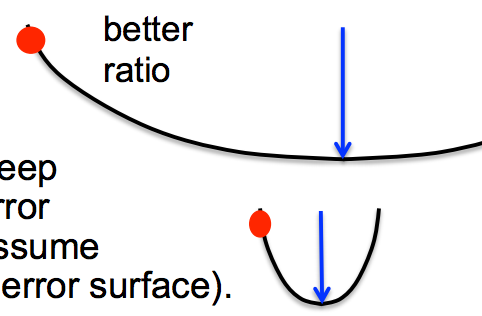

# Week 8 - More RNNs

## 8a - A brief overview of “Hessian-Free” optimization
### 8a-02 - How much can we reduce the error by moving in a given direction?
* If we choose a direction to move in and we keep going in that direction, 
  how much does the error decrease before it starts rising again? 
  * We assume the curvature is constant (i.e. it’s a quadratic error surface).
  * We Assume the magnitude of the gradient decreases as we
    move down the gradient (i.e. the error surface is convex
    upward). 
* Maximum error reduction depends on the **ratio of the
  gradient to the curvature**
* 
  * the first error bowl has low curvature, so ratio of error gradient to curvature 
    is high
  * the first error bowl has high curvature, so ratio of error gradient to 
    curvature is lower

### 8a-03 - Newton’s method
* The basic problem with steepest descent on a quadratic error surface
  is that the gradient is not the direction we want to go in.
  * If the error surface has circular cross-sections, the gradient is fine.
  * So lets apply a linear transformation that turns ellipses into circles. 
* Newton’s method multiplies the gradient vector by the inverse of the
  curvature matrix, H: 
  $$
  \delta \bm w = - \varepsilon H( \bm w )^{-1} \frac{ dE }{ d \bm w }
  $$
* On a real quadratic surface it jumps to the minimum in one step.
* Unfortunately, with only a million weights, the curvature matrix has
  a trillion terms and it is totally infeasible to invert it.
  

### 8a-04 - Curvature Matrices
### 8a-05 - How to avoid inverting a huge matrix
### 8a-06 - Conjugate gradient
### 8a-07 - A picture of conjugate gradient 
### 8a-07 - What does conjugate gradient achieve?

## 8b - Modeling character strings with multiplicative connections 
### 8b-02 - Modeling text: Advantages of working with characters
* [00:00](https://www.coursera.org/learn/neural-networks/lecture/qGmdv/modeling-character-strings-with-multiplicative-connections-14-mins)
### 8b-03 - An obvious recurrent neural net 
### 8b-04 - A sub-tree in the tree of all character strings
### 8b-05 - Multiplicative connections
### 8b-06 - Using factors to implement multiplicative interactions 
### 8b-07 - Using factors to implement a set of basis matrices
### 8b-08 - Using 3-way factors to allow a character to create a whole transition matrix

## 8c - Learning to predict the next character using HF
### 8c-02 - Training the character model 
### 8c-03 - How to generate character strings from the model 
### 8c-04 - example
> He was elected President during the Revolutionary
> War and forgave Opus Paul at Rome. The regime
> of his crew of England, is now Arab women's icons
> in and the demons that use something between
> the characters‘ sisters in lower coil trains were
> always operated on the line of the **ephemerable**
> street, respectively, the graphic or other facility for
> deformation of a given proportion of large
> segments at RTUS**)**. The B every chord was a
> "strongly cold internal palette pour even the white
> blade.” 
### 8c-05 - Some completions produced by the model
### 8c-06 - What does it know? 
### 8c-07 - RNNs for predicting the next word

## 8d - Echo state networks 
### 8d-02 - The key idea of echo state networks
* (perceptrons again?)
### 8d-03 - Setting the random connections in an Echo State
Network
### 8d-04 - A simple example of an echo state network
### 8d-05 - Example from Scholarpedia
### 8d-06 - The target and predicted outputs after learning
### 8d-07 - Beyond echo state networks

# Week 8 Quiz

# Week 8 Vocab

* *TBD*

# Week 8 FAQ

* TBD

# Week 8 Other

## Papers

TBD

## Week 8 Links

* TBD

## Week 8 People

### Ilya Sutskever
* has shown that if weights are initialized using echo state
  network methods, RNNs can be trained very effectively, 
  by using rmsprop with momentum.

